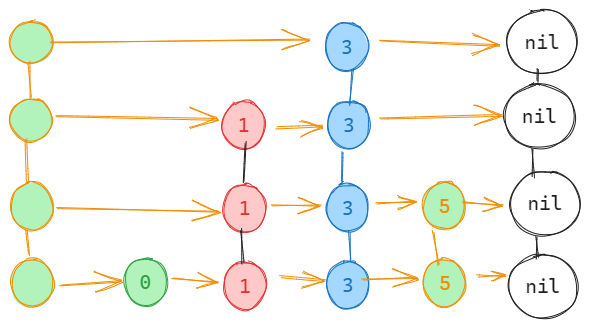

# lsm tree 实现一个 kv 存储组件
## 1 存储组件

### 1.1 场景区分

存储组件根据其读写频次可以分为写密集型和读密集型, 面向读密集型典型是 MySQL 的 innodb 存储引擎, 
底层基于 B+ tree 实现存储文件的组织和管理; 面向写密集型的典型是基于 lsm tree 实现的各类数据库

### 1.2 lsm 写入策略

在基于kv型存储的组件中, 有原地写和追加写两种:

- 原地写: 要对kv对执行更新操作时, 要 **先找到kv对的位置** , 然后**原地改写**

- 追加写: 将 kv 对以追加的形式**加入到末尾**, 查询时**从后往前**找到第一个符合条件的kv对


原地写的读取效率更加高效, 不像追加写有数据冗余, 有更高的空间利用率; 
追加写读流程退化成了的线性的查询, RocksDB 是在追加写的基础上提高查询的效率.

## 2 lsm tree

### 2.1 追加写存在的问题

- 数据冗余 --> 数据合并, 文件分块
- 读性能低 --> 数据有序存储, 内存 + 磁盘, 预写日志, 内存读写 + 读写分层, 内存数据结构, 磁盘分层, sstable
  
以下篇幅针对解决这两个问题而设立
### 2.2 数据合并

既然同一组数据会存在冗余, 那么我们可以**启动一个异步的协程将冗余数据进行压缩合并**, 
只保留最新的数据, 既然是异步的协程, 那么我们就要**考虑加锁的粒度**, 防止在性能上有太大的损失

### 2.3 文件分块

异步的压缩写成需要加锁, 会影响写操作的性能, 我们考虑讲数据分块隔离, 以此在物理上隔离压缩操作和写操作,
如果我们能够对数据进行分块, **追加的数据在新块上追加, 异步的压缩协程在旧块上压缩**


### 2.4 数据的有序存储

线性的读取效率是我们不能接受的, 我们可以在kv对的存储方式上下功夫, 在每个分块的内部,
可以实现**根据k进行排序, 使用二分的方式进行搜索**


### 2.5 内存 + 磁盘

有序存储实际上是与追加写相悖的, 可以在内存中引入一个内存块(memtable)的结构, 
在**内存中进行过排序之后再放入磁盘**, 内存的读写效率要高于磁盘, 可以接受在内存随机IO的代价, 
可以在内存执行随机写, 刷新入内存的时候以table为粒度存储, 这样就保证了磁盘文件的天然有序

引入缓存之后, 也引发几个问题:
1. 内存是非持久化的, 如何对数据进行持久化 
2. 在进行溢写操作的时候, 外部的写操作需要阻塞, 引起性能的损失 
3. 内存中是有序存储, 应该如何保存数据, 使用怎样的数据结构

### 2.6 预写日志

如何进行数据持久化, 或者说机器宕机之后如何进行数据恢复, **引入WAL预写日志技术**: 
数据在内存进行更新的同时, 将操作记录追加写到磁盘的WAL文件中, 
这样在宕机之后可以通过查看日志的方式恢复数据

初次之外, WAL也将内存溢写到磁盘过程中丢失的风险消失了, WAL是磁盘顺序IO, 不会成为性能的瓶颈

### 2.7 内存读写 + 读写分层

内存溢写期间写操作如何处理:

处理方式类似于java的垃圾回收(可能), 将memtable赋值一份, **将旧数据归属到只读部分, 
专注于执行溢写磁盘流程, 建立一个新的空白部分, 这个空白memtable专注于写操作**, 
溢写期间读写分离也就不需要阻塞了

### 2.8 内存数据结构

内存的数据需要有序, 保证读写效率, 有两种选择都可以实现读写操作O(logN)时间复杂度: 红黑树 和 跳表

读写效率两者差不多, 但是跳表具有更简单的实现和更细的并发粒度两大核心优势

红黑树由于自身的染色机制, 每次写操作都要对整棵树进行加锁, 
**跳表可以针对插入节点局部范围内最大高度加锁**, 很多场景可以做到并发写

### 2.9 磁盘分层

磁盘因为分块, 我们能够保证块内的数据有序和去重, 但是块与块之间可能存在冗余kv对, 而且无法做到全局有序

在此基础上引入磁盘分层的概念:

- 磁盘分为level0-levelk总共k+1层
- 每层的块数量一致, 但是容量level(i+1)是level(i)层的T倍(通常取10左右)
- 数据由浅入深, 层层渐进, 当level内数据总量到达阈值, 发起向高一层的归并操作, 这个操作期间进行去重和排序, 保证kv对无重复和全局有序

综上磁盘分层带来的特点:

1. level0 不同块之间存在 kv 对数据冗余且不保证全局有序
2. level1-levelk 单层之内没有冗余kv数据, 且全局有序
3. 不同层之间可能存在kv冗余的数据
4. 最近写入的数据位于浅层, 更早写入的数据位于深层
5. levelk作为最深的一层, 沉淀的数量达到全局90%左右


归并过程, (level1 -> level2)

假设此时level1数据达到阈值, 接下来法刺归并操作:

1. 从level1中随机选择一个块, 可以确定块中k的范围
2. 在level2中确定范围重合的待合并块
3. 与这些块进行归并排序
4. 将新生成的块更具大小规模进行拆分并进行插入
5. 删除level1中老数据
6. 假设这个过程引起了level2的容量超出阈值, 则会引起下一层的合并


### 2.10 sstable

为磁盘的块设计专门的主句结构sstable(sorted string table)

1. 内部会进一步拆分成多个子块
2. 维护一些索引信息, 方便查询
3. lsm tree 维护一个全局索引信息, 记录不同level中每个sstable对应的key范围
4. 每个sstable维护一个布隆过滤器, 用于快速判断一个k是否处于当前sstable中

## 3 lsm tree 读写流程

### 3.1 写流程

就地写模式, 写入内存的active memtable(非可读内存块) ==> active memtable达到阈值之后转换为只读的 readonly memtable并刷新到磁盘成为level0的sstable ==> level(i)容量满之后基于归并的方式合并到下一层

### 3.2 读流程

读active memtable ==> 读 readonly memtable ==> 读 level0(需要按照倒序搜索, 因为level0存在数据冗余) ==> 根据全局索引文件, 以此读level1 ~ levelk(每一次最多读一个sstable) ==> 借助sstable内部布隆过滤器和索引加快查询流程

## 4 布隆过滤器

当我们考虑大量数据进行去重时, 简单方法可以使用一个 `map` 进行存储, 但是这样的空间复杂度是O(n),
对于大量数据这是我们无法接受的

也可以考虑使用一个 `bitmap` 进行存储, 但是存在哈希碰撞的问题, 大量数据情况下很难避免误判

一个比较好的解决办法是使用布隆过滤器, 布隆过滤器是一个位数组, 通过多个哈希函数对数据进行映射,
当一个数据被映射到多个位置时, 将这些位置的值置为1, 当查询一个数据时, 只要有一个位置的值为0, 则说明数据不存在,
通过多个位置的映射, 可以有效的减少哈希碰撞的概率


### 4.1 接口定义
可以通过实现过滤器的接口来自定义
```go
// Filter 过滤器接口, 用于辅助 sstable 快速判断一个 key 是否在 block 中
type Filter interface {
    Add(key []byte)                // 向过滤器中添加key
    Exist(bitmap, key []byte) bool // 判断key是否存在于过滤器中
    Hash() []byte                  // 获取过滤器的hash值
    Reset()                        // 重置过滤器
    KeyLen() int                   // 获取key的数量
}
```
### 4.2 布隆过滤器的实现
`m` 代表bitmap的长度, 设置合适的长度可以减少误判的概率,
`hashedKeys` 代表添加到布隆过滤器的一系列key的hash值
```go
// BloomFilter 布隆过滤器
type BloomFilter struct {
	m          int      // bitmap 的长度，单位 bit
	hashedKeys []uint32 // 添加到布隆过滤器的一系列 key 的 hash 值
}

// NewBloomFilter 布隆过滤器构造器
func NewBloomFilter(m int) (*BloomFilter, error) {
	if m <= 0 {
		return nil, errors.New("m must be postive")
	}
	return &BloomFilter{
		m: m,
	}, nil
}
```

### 4.3 添加key
每添加一个key, 将key的hash值添加到 `hashedKeys` 中
使用的算法是 murmur3, github地址为: "github.com/spaolacci/murmur3"
```go
// Add 添加一个 key 到布隆过滤器
func (bf *BloomFilter) Add(key []byte) {
	bf.hashedKeys = append(bf.hashedKeys, murmur3.Sum32(key))
}
```

### 4.4 构造bitmap
当所有 key 都完成添加后，可以调用 Hash 方法生成对应的 filter bitmap：
1. 根据  `m(bitmap长度)` 和 `n(key数量)` 计算出最佳的 hash 函数个数 k,
k 最佳计算公式：`k = ln2 * m / n`
2. 构造出一个空的 bitmap，最后一个 byte 位值设置为 k(hash函数个数)
3. 生成 hash 函数，第一个基准 hash 函数 h1 = murmur3.Sum32, 
第二个基准 hash 函数 h2 = h1 >> 17 | h2 << 15
4. 通过 h1 和 h2 线性无关的组合生成其他 hash 函数
5. 通过 hash 函数计算出每个 key 对应的 bitmap 位置，将对应位置的值置为 1
6. 返回 bitmap
```go
// Hash 生成过滤器对应的 bitmap. 最后一个 byte 标识 k 的数值
func (bf *BloomFilter) Hash() []byte {
	// k: 根据 m 和 n 推导出最佳 hash 函数个数
	k := bf.bestK()
	// 获取出一个空的 bitmap，最后一个 byte 位值设置为 k
	bitmap := bf.bitmap(k)

	// 第一个基准 hash 函数 h1 = murmur3.Sum32
	// 第二个基准 hash 函数 h2 = h1 >> 17 | h2 << 15
	// 之后所有使用的 hash 函数均通过 h1 和 h2 线性无关的组合生成
	// 第 i 个 hash 函数 gi = h1 + i * h2
	for _, hashedKey := range bf.hashedKeys {
		// hashedKey 为 h1
		// delta 为 h2
		delta := (hashedKey >> 17) | (hashedKey << 15)
		for i := uint32(0); i < uint32(k); i++ {
			// 第 i 个 hash 函数 gi = h1 + i * h2
			// 需要标记为 1 的 bit 位
			targetBit := (hashedKey + i*delta) % uint32(len(bitmap)<<3)
			bitmap[targetBit>>3] |= (1 << (targetBit & 7))
		}
	}

	return bitmap
}

// 生成一个空的 bitmap
func (bf *BloomFilter) bitmap(k uint8) []byte {
	// bytes = bits / 8 (向上取整)
	bitmapLen := (bf.m + 7) >> 3
	bitmap := make([]byte, bitmapLen+1)
	// 最后一位标识 k 的信息
	bitmap[bitmapLen] = k
	return bitmap
}

// 根据 m 和 n 推算出最佳的 k
func (bf *BloomFilter) bestK() uint8 {
	// k 最佳计算公式：k = ln2 * m / n  m——bitmap 长度 n——key个数
	k := uint8(69 * bf.m / 100 / len(bf.hashedKeys))
	// k ∈ [1,30]
	if k < 1 {
		k = 1
	}
	if k > 30 {
		k = 30
	}
	return k
}

```
### 4.5 判断key是否存在
判断 key 是否存在于一个 filter bitmap 中，采取如下步骤：
1. 获取 bitmap 中的 k 值, 也就是哈希函数的个数
2. 生成 hash 函数，第一个基准 hash 函数 h1 = murmur3.Sum32,
3. 第二个基准 hash 函数 h2 = h1 >> 17 | h2 << 15
4. 通过 h1 和 h2 线性无关的组合生成其他 hash 函数
5. 通过 hash 函数计算出 key 对应的 bitmap 位置，如果值为 1，则继续判断；如果值为 0，则 key 肯定不存在
6. 如果 key 映射的所有 bit 位均为 1，则认为 key 存在（存在误判概率）
7. 返回 key 是否存在
```go
// Exist 判断过滤器中是否存在 key（注意，可能存在假阳性误判问题）
func (bf *BloomFilter) Exist(bitmap, key []byte) bool {
	// 生成 bitmap 时，需要把哈希函数个数 k 的值设置在 bitmap 的最后一个 byte 上
	if bitmap == nil {
		bitmap = bf.Hash()
	}
	// 获取hash 函数的个数 k
	k := bitmap[len(bitmap)-1]

	// 第一个基准 hash 函数 h1 = murmur3.Sum32
	// 第二个基准 hash 函数 h2 = h1 >> 17 | h2 << 15
	// 之后所有使用的 hash 函数均通过 h1 和 h2 线性无关的组合生成
	// 第 i 个 hash 函数 gi = h1 + i * h2

	// h1
	hashedKey := murmur3.Sum32(key)
	// h2
	delta := (hashedKey >> 17) | (hashedKey << 15)
	for i := uint32(0); i < uint32(k); i++ {
		// gi = h1 + i * h2
		targetBit := (hashedKey + i*delta) % uint32(len(bitmap)<<3)
		// 找到对应的 bit 位，如果值为 1，则继续判断；如果值为 0，则 key 肯定不存在
		if bitmap[targetBit>>3]&(1<<(targetBit&7)) == 0 {
			return false
		}
	}

	// key 映射的所有 bit 位均为 1，则认为 key 存在（存在误判概率）
	return true
}
```
### 4.6 其他
- 重置过滤器
- 获取过滤器中存在的 key 个数
```go
// Reset 重置过滤器
func (bf *BloomFilter) Reset() {
	bf.hashedKeys = bf.hashedKeys[:0]
}

// KeyLen 获取过滤器中存在的 key 个数
func (bf *BloomFilter) KeyLen() int {
	return len(bf.hashedKeys)
}
```
## 5 wal 日志
wal 日志是一种预写日志, 用于在内存中的数据持久化到磁盘, 以此保证数据的一致性

它需要实现两个功能, 读取wal日志内容并进行复原, 将内存中的数据操作写入到wal日志中
### 5.1 reader
#### 5.1.1 reader 结构体定义
```go
// WALReader 用于预写日志的读取
type WALReader struct {
	file   string        // 预写日志的日志文件名, 是包含了目录在内的完整路径
	src    *os.File      // 实际的文件
	reader *bufio.Reader // 读取器
}

func NewWALReader(file string) (*WALReader, error) {
	// 以只读模式打开文件, 如果文件不存在则创建
	src, err := os.OpenFile(file, os.O_RDONLY, 0644)
	if err != nil {
		return nil, err
	}

	return &WALReader{
		file:   file,
		src:    src,
		reader: bufio.NewReader(src),
	}, nil
}
```
#### 5.1.2 复原数据
读取wal日志内容并进行复原, 步骤如下:
1. 读取wal文件内容
2. 解析文件内容为key-value对: 长度 + key + value
3. 将key-value对写入memtable
4. 重置文件偏移量
```go
func (w *WALReader) RestoreToMemtable(memTable memtable.MemTable) error {
	// 读取WAL文件, 将其中的数据恢复到memtable中
	body, err := io.ReadAll(w.reader)
	if err != nil {
		return err
	}

	// 保证文件偏移量被重置
	defer func() {
		_, _ = w.src.Seek(0, io.SeekStart)
	}()

	// 将文件中读取到的内容解析为 key-value 对
	kvs, err := w.readAll(bytes.NewReader(body))
	if err != nil {
		return err
	}

	// 将 key-value 对写入 memtable
	for _, kv := range kvs {
		memTable.Put(kv.Key, kv.Value)
	}
	return nil
}

// 将文件中读取到的内容解析为 key-value 对
func (w *WALReader) readAll(reader *bytes.Reader) ([]*memtable.KV, error) {
	var kvs []*memtable.KV
	// 循环读取 key-value 对
	for {
		// 存储的格式为: 长度 + key + value
		// 读取 key 的长度
		keyLen, err := binary.ReadUvarint(reader)

		// 如果读取到文件末尾, 则退出循环
		if err == io.EOF {
			break
		}
		if err != nil {
			return nil, err
		}

		// 读取 value 的长度
		valueLen, err := binary.ReadUvarint(reader)
		if err != nil {
			return nil, err
		}

		// 读取 key
		key := make([]byte, keyLen)
		if _, err = io.ReadFull(reader, key); err != nil {
			return nil, err
		}

		// 读取 value
		value := make([]byte, valueLen)
		if _, err = io.ReadFull(reader, value); err != nil {
			return nil, err
		}

		kvs = append(kvs, &memtable.KV{
			Key:   key,
			Value: value,
		})
	}
	return kvs, nil
}
```
### 5.2 writer
writer的工作就是把kv对记录为日志, 并写入wal文件中
#### 5.2.1 writer 结构体定义
```go
// WALWriter 用于预写日志的写入
type WALWriter struct {
	file         string   // 预写日志的日志文件名, 是包含了目录在内的完整路径
	dest         *os.File // 实际的文件
	assistBuffer [30]byte // 辅助缓冲区
}

func NewWALWriter(file string) (*WALWriter, error) {
	// 打开文件, 如果文件不存在则创建
	dest, err := os.OpenFile(file, os.O_CREATE|os.O_WRONLY, 0644)
	if err != nil {
		return nil, err
	}

	return &WALWriter{
		file: file,
		dest: dest,
	}, nil
}

```
#### 5.2.2 写入数据
操作步骤:
1. 将key和value的长度写入缓冲区
2. 将key和value写入缓冲区, 格式为: 长度 + key + value
3. 将缓冲区写入文件
4. 返回错误信息
```go
func (w *WALWriter) Write(key, value []byte) error {
	// 首先将 key 和 value 的长度写入缓冲区
	n := binary.PutUvarint(w.assistBuffer[0:], uint64(len(key)))
	n += binary.PutUvarint(w.assistBuffer[n:], uint64(len(value)))

	// 将 key 和 value 写入缓冲区, 格式为: 长度 + key + value
	var buf []byte
	buf = append(buf, w.assistBuffer[:n]...)
	buf = append(buf, key...)
	buf = append(buf, value...)
	_, err := w.dest.Write(buf)
	return err
}
```

## 6 跳表
### 6.1 接口定义
只要实现了这个接口都可以作为内存块 `memtable` 的数据结构
```go
// MemTable MemTable 内存表接口
type MemTable interface {
	Put(key, value []byte)         // 写入数据
	Get(key []byte) ([]byte, bool) // 读取数据, flag 为 true 时表示数据存在
	All() []*KV                    // 获取所有数据
	Size() int                     // 获取数据长度
	EntriesCnt() int               // 获取数据数量
}
```
### 6.2 结构体定义

```go
type skipNode struct {
	nexts      []*skipNode // 实现跳表的多层索引
	key, value []byte      // key - value
}

// Skiplist 跳表 不保证并发安全
type Skiplist struct {
	head       *skipNode // 跳表头节点
	entriesCnt int       // 跳表节点数量
	size       int       // 跳表大小, kv对的数据量大小
}

// NewSkiplist 构建跳表实例
func NewSkiplist() MemTable {
	return &Skiplist{
		head: &skipNode{},
	}
}

```
### 6.3 读流程

1. 从最高层开始查找, 向右移动, 直到下一个节点为空或者下一个节点的key大于等于给定的key, 说明当前节点是最接近给定key的节点
2. 如果下一个节点的key等于给定的key, 说明找到了, 否则继续向下一层查找
3. 如果找到了, 返回节点的value, 否则返回nil
4. 时间复杂度为O(logN)
```go
// Get 从跳表中获取数据
func (s *Skiplist) Get(key []byte) ([]byte, bool) {
	if node := s.getNode(key); node != nil {
		return node.value, true
	}
	return nil, false
}

```
```go
func (s *Skiplist) getNode(key []byte) *skipNode {
	move := s.head
	// 从最高层开始查找
	for level := len(s.head.nexts) - 1; level >= 0; level-- {
		// 向右移动, 直到下一个节点为空或者下一个节点的key大于等于给定的key, 说明当前节点是最接近给定key的节点
		for move.nexts[level] != nil && bytes.Compare(move.nexts[level].key, key) < 0 {
			move = move.nexts[level]
		}
		// 如果下一个节点的key等于给定的key, 说明找到了, 否则继续向下一层查找
		if move.nexts[level] != nil && bytes.Compare(move.nexts[level].key, key) == 0 {
			return move.nexts[level]
		}
	}
	return nil
}
```
### 6.4 写流程
1. 如果可以从跳表中找到key, 则更新value
2. 如果key不存在就要插入节点
3. 随机生成一个高度
4. 如果跳表的高度不足, 则补充
5. 每层按照key的大小插入
6. 时间复杂度为O(logN)
```go
// Put 向跳表中添加数据, 如果key已经存在, 则更新value
func (s *Skiplist) Put(key, value []byte) {
	// 如果可以从跳表中找到key, 则更新value
	if node := s.getNode(key); node != nil {
		// 更新跳表大小, 因为要落盘到文件中, 所以需要记录数据量大小
		s.size += len(value) - len(node.value)
		// 更新value
		node.value = value
		return
	}

	// 如果key不存在就要插入节点
	s.size += len(key) + len(value)
	s.entriesCnt++
	// 随机生成一个高度
	newNodeHeight := s.roll()
	// 如果跳表的高度不足, 则补充
	if len(s.head.nexts) < newNodeHeight {
		// 补充差值
		dif := make([]*skipNode, newNodeHeight-len(s.head.nexts))
		// 从最后一个节点开始补充
		s.head.nexts = append(s.head.nexts, dif...)
	}

	// 构建新的节点
	newNode := skipNode{
		nexts: make([]*skipNode, newNodeHeight),
		key:   key,
		value: value,
	}

	// 每层按照key的大小插入
	move := s.head
	for level := newNodeHeight - 1; level >= 0; level-- {
		// 向右移动, 直到下一个节点为空或者下一个节点的key大于等于给定的key, 说明当前节点是最接近给定key的节点
		for move.nexts[level] != nil && bytes.Compare(move.nexts[level].key, key) < 0 {
			move = move.nexts[level]
		}
		// 插入节点
		newNode.nexts[level] = move.nexts[level]
		move.nexts[level] = &newNode
	}
}
```
```go
func (s *Skiplist) roll() int {
	var level int
	rander := rand.New(rand.NewSource(time.Now().UnixNano()))
	for rander.Intn(2) == 1 {
		level++
	}
	return level + 1
}
```

## 7 Config
### 7.1 Config 结构体
```go
// Config 配置文件
type Config struct {
	Dir      string // sst文件存储目录
	MaxLevel int    // lsm tree 的最大层数

	SSTSize          uint64 // sst文件大小
	SSTNumPerLevel   int    // 每一层的sst文件数量
	SSTDataBlockSize int    // sst文件数据块大小
	SSTFooterSize    int    // sst文件footer大小

	Filter              filter.Filter                // 过滤器, 默认为布隆过滤器
	MemTableConstructor memtable.MemTableConstructor // 内存表构造器, 默认为跳表
}

```
### 7.2 Config 配置
```go
func NewConfig(dir string, opts ...ConfigOption) (*Config, error) {
	c := Config{
		Dir:           dir, // sst文件存储目录
		SSTFooterSize: 32,  // sst文件footer大小, 对应 4 个 uint64, 共 32 字节
	}
	// 加载其他配置
	for _, opt := range opts {
		opt(&c)
	}
	// 兜底修复
	repaire(&c)
	// 检查配置
	return &c, c.check()
}

```
opt ,repaire 和 check 方法不具体展现了
## 